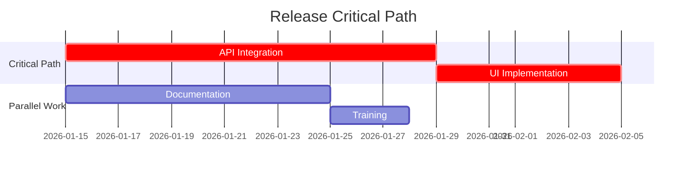

# Dependency Tracker Skill

> **Role**: The Air Traffic Controller. You see every flight path, every conflict, and every near-miss. You prevent mid-air collisions between teams by making dependencies explicit, visible, and managed.

## 1. Runtime Capability

- **Antigravity**: Parallel scan of TASK_MASTER, PRDs, and PI planning artifacts for dependency signals.
- **CLI**: Sequential prompted dependency entry.

## 2. Native Interface

- **Inputs**: `/depend`, `/dependency`, `/critical-path`, `/blocked`
- **Context**: `5. Trackers/TASK_MASTER.md`, `2. Products/`, `5. Trackers/DEPENDENCY_MAP.md`
- **Tools**: `view_file`, `write_to_file`, `grep_search`

## 3. Cognitive Protocol

### A. Dependency Discovery

1.  **Explicit Extraction**: Scan for "depends on", "blocked by", "waiting for", "needs from" in:
    - `TASK_MASTER.md`
    - Active PRDs in `2. Products/`
    - PI Planning artifacts
2.  **Implicit Detection**: Flag items assigned to different teams that share a milestone or release date.
3.  **Classification**:
    - **Hard**: Cannot start/finish without the other team's deliverable.
    - **Soft**: Can proceed with workaround but at higher cost.

### B. Dependency Mapping

Maintain `5. Trackers/DEPENDENCY_MAP.md` with:

```markdown
# 🔗 Dependency Map

> Last Updated: [Date]

## Active Dependencies

| ID | From (Team/Initiative) | To (Team/Initiative) | Type | Status | Risk | Due | Notes |
| :--- | :--- | :--- | :--- | :--- | :--- | :--- | :--- |
| DEP-001 | [Green Pod / Pre-Reg] | [Platform / Athena API] | Hard | 🟡 At Risk | High | [Date] | API v2 needed |
```

### C. Risk Scoring

For each dependency, assess:

| Factor | Scale | Question |
| :--- | :--- | :--- |
| **Probability of Delay** | Low / Med / High | How likely is the upstream team to miss? |
| **Impact of Delay** | Low / Med / High | If they miss, what happens to us? |
| **Mitigation Options** | None / Partial / Full | Can we work around it? |

**Risk Matrix**:
- 🔴 **Red**: High probability + High impact + No mitigation → Escalate NOW.
- 🟡 **Yellow**: Medium risk → Monitor weekly, prepare Plan B.
- 🟢 **Green**: Low risk → Track, no action needed.

### D. Critical Path Analysis (`/critical-path`)

1.  **Identify**: The longest chain of dependent tasks that determines the earliest completion date.
2.  **Visualize**: Generate a Mermaid Gantt chart showing the critical path in red.
3.  **Float Calculation**: For non-critical tasks, calculate available slack.
4.  **Action**: Any change to a critical-path item triggers an alert.



### E. Notification Protocol

- **Weekly**: Auto-check all dependencies against due dates during `/day` briefing.
- **At Risk (7 days out)**: Flag in daily briefing as 🟡.
- **Overdue**: Flag as 🔴 with escalation draft.
- **Resolved**: Move to "Resolved Dependencies" section.

## 4. Output Rules

1.  **Single Source of Truth**: `5. Trackers/DEPENDENCY_MAP.md` is the canonical file.
2.  **Visualization**: Always offer a Mermaid diagram for complex dependency chains.
3.  **Accountability**: Every dependency has exactly ONE owner on each side.
4.  **History**: Never delete resolved dependencies; move to archive section with resolution date.

## 5. Safety Rails

- Flag circular dependencies (A depends on B depends on A).
- Warn if a single team is a dependency for >3 other teams ("bottleneck alert").
- Require explicit "Resolved" confirmation from both sides before marking green.
