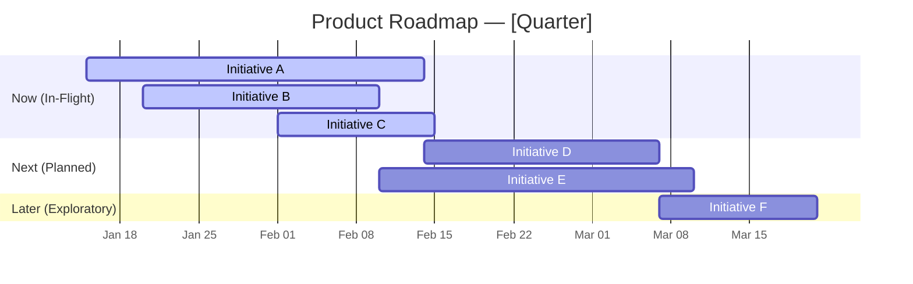

# 🗺️ Product Roadmap: [Product Name]

**Owner**: [Name]
**Quarter**: [Q1/Q2/Q3/Q4 YYYY]
**Last Updated**: [Date]
**Status**: Draft / Aligned / Approved

---

## 🎯 Strategic Context

> **Vision**: [1-sentence product vision]
> **North Star Metric**: [Primary metric we're optimizing]

## Theme Legend

| Theme | Description | OKR Alignment |
| :--- | :--- | :--- |
| 🔵 Growth | User acquisition & activation | O1: KR2 |
| 🟢 Retention | User engagement & stickiness | O2: KR1 |
| 🔴 Tech Health | Reliability, performance, debt | O3: KR3 |
| 🟡 Compliance | Regulatory & certification | O1: KR4 |

---

## Now (This Sprint/PI)

> **Commitment Level**: 🔒 Locked — these are in-flight.

| Priority | Initiative | Theme | Owner | Status | Target Metric |
| :--- | :--- | :--- | :--- | :--- | :--- |
| P0 | [Initiative A] | 🔵 | @name | 🟢 On Track | [Metric → Target] |
| P0 | [Initiative B] | 🔴 | @name | 🟡 At Risk | [Metric → Target] |
| P1 | [Initiative C] | 🟢 | @name | 🟢 On Track | [Metric → Target] |

## Next (Next Sprint/PI)

> **Commitment Level**: 🔓 Planned — scope may adjust.

| Priority | Initiative | Theme | Owner | Confidence | Dependencies |
| :--- | :--- | :--- | :--- | :--- | :--- |
| P1 | [Initiative D] | 🟡 | @name | 80% | [Dependency] |
| P1 | [Initiative E] | 🔵 | @name | 60% | None |

## Later (Backlog / Horizon 2-3)

> **Commitment Level**: 🔮 Exploratory — ideas under consideration.

| Initiative | Theme | Rationale | Evidence Strength |
| :--- | :--- | :--- | :--- |
| [Initiative F] | 🔵 | [Why this matters] | Moderate |
| [Initiative G] | 🟢 | [Why this matters] | Weak — needs discovery |

---

## 📊 Gantt View (Mermaid)

---

## ⚠️ Key Risks & Dependencies

| Risk/Dependency | Impact | Mitigation | Owner |
| :--- | :--- | :--- | :--- |
| [Risk 1] | [Impact] | [Plan] | @name |
| [Dependency on Team X] | [Blocker if missed] | [Alternative plan] | @name |

---

## 📝 Change Log

| Date | Change | Reason |
| :--- | :--- | :--- |
| [Date] | [What changed] | [Why] |
