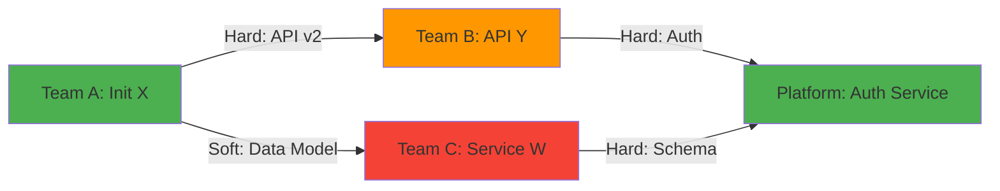

# 🔗 Dependency Map

**Product/Program**: [Name]
**Last Updated**: [Date]
**Owner**: [Name]

---

## Active Dependencies

| ID | From (Team/Initiative) | To (Team/Initiative) | Type | Status | Risk | Due | Owner | Notes |
| :--- | :--- | :--- | :--- | :--- | :--- | :--- | :--- | :--- |
| DEP-001 | [Team A / Initiative X] | [Team B / API Y] | Hard | 🟢 On Track | Low | [Date] | @name | [Context] |
| DEP-002 | [Team A / Initiative Z] | [Team C / Service W] | Hard | 🟡 At Risk | Med | [Date] | @name | [Context] |
| DEP-003 | [Team B / Feature V] | [Team A / Data Model] | Soft | 🔴 Blocked | High | [Date] | @name | [Context] |

---

## Risk Matrix

| | Low Impact | Medium Impact | High Impact |
| :--- | :--- | :--- | :--- |
| **High Probability** | 🟡 Monitor | 🔴 Mitigate NOW | 🔴 Escalate NOW |
| **Med Probability** | 🟢 Accept | 🟡 Monitor | 🔴 Mitigate NOW |
| **Low Probability** | 🟢 Accept | 🟢 Accept | 🟡 Monitor |

---

## Dependency Graph (Mermaid)

> **Legend**: 🟢 Green = On Track | 🟡 Orange = At Risk | 🔴 Red = Blocked

---

## Resolved Dependencies

| ID | From | To | Resolved Date | Resolution |
| :--- | :--- | :--- | :--- | :--- |
| DEP-000 | [Team X] | [Team Y] | [Date] | [How it was resolved] |

---

## Bottleneck Watch

| Team | Dependencies Serving | Alert |
| :--- | :--- | :--- |
| [Team Name] | [Count] | ⚠️ Bottleneck (>3 teams depending) |
