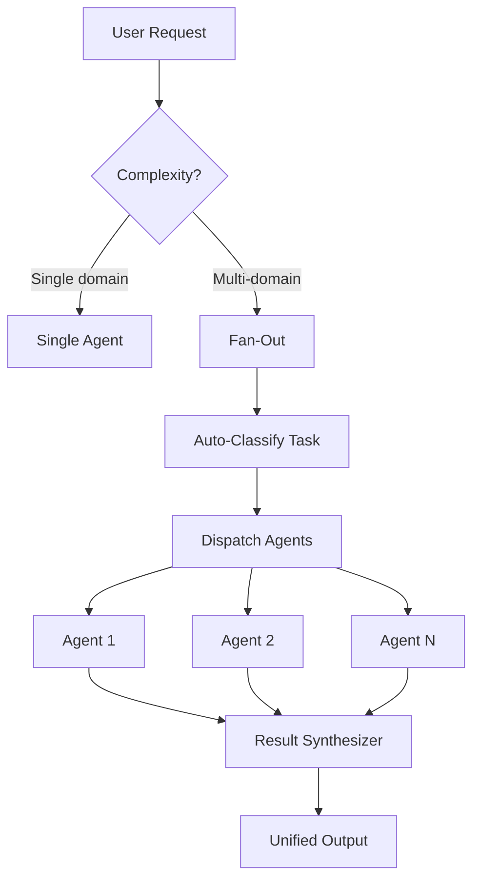

# /fan-out — Multi-Agent Parallel Dispatch Workflow

**Trigger**: `/fan-out [task description]` or when a task requires multiple domain perspectives simultaneously.

> **Capability**: This workflow activates multiple agents in parallel, collects their outputs, resolves conflicts, and produces a unified response. It is the core of the Antigravity agentic mesh.

---

## When to Use Fan-Out



### Fan-Out Triggers

| Request Type | Agents Activated |
|:-------------|:----------------|
| PRD from scratch | `staff-pm` + `ux-researcher` + `tech-lead` |
| Launch planning | `gtm-lead` + `program-manager` + `staff-pm` |
| Strategic roadmap | `cpo` + `strategist` + `data-scientist` |
| Release coordination | `program-manager` + `tech-lead` + `staff-pm` |
| Discovery sprint | `staff-pm` + `ux-researcher` + `data-scientist` |
| Competitive analysis | `strategist` + `data-scientist` |
| Custom | Specify agents explicitly |

---

## Execution Protocol

### Step 1: Task Classification

Before dispatching, identify the task type:

```
Task Context → Keyword Matching → Agent Roster Selection
```

| Keywords | Recommended Roster |
|:---------|:------------------|
| "plan", "roadmap", "vision" | `cpo`, `strategist` |
| "prd", "spec", "requirements" | `staff-pm` |
| "launch", "gtm" | `gtm-lead`, `program-manager` |
| "data", "metrics", "funnel" | `data-scientist` |
| "user research", "interview" | `ux-researcher` |
| "release", "dependency" | `program-manager`, `staff-pm` |

### Step 2: Parallel Dispatch

**Rule**: All independent agents MUST be dispatched simultaneously.
**Never**: Chain agents sequentially if their tasks are independent.

```python
# system/scripts/agent_dispatcher.py
from system.scripts.agent_dispatcher import fan_out

results = fan_out(
    task={"type": "prd", "context": "Notification center feature"},
    agents=["staff-pm", "ux-researcher", "tech-lead"]
)
```

### Step 3: Result Synthesis

After all agents complete:

```python
# system/scripts/result_synthesizer.py
from system.scripts.result_synthesizer import merge_to_markdown

summary = merge_to_markdown(
    task={"type": "prd", "context": "..."},
    results=results,
    output_file=Path("artifacts/fan-out-synthesis.md")
)
```

### Step 4: Conflict Resolution

If the synthesizer detects conflicts:

1. **Check** `merged_output.conflicts` for the specific keys
2. **Escalate** to CPO for strategic conflicts
3. **Decide** using Evidence-Based Decision Protocol (GEMINI.md Tier 2)
4. **Log** decision in `5. Trackers/DECISION_LOG.md`

### Step 5: Route to Trackers

Apply the synthesized output using standard routing:

| Output Type | Destination |
|:-----------|:-----------|
| PRD / Spec | `2. Products/[Company]/[Product]/` |
| Task items | `5. Trackers/TASK_MASTER.md` |
| Decision | `5. Trackers/DECISION_LOG.md` |
| Risk items | `5. Trackers/DEPENDENCY_MAP.md` |
| Boss Ask | `5. Trackers/critical/boss-requests.md` |

---

## Output Format

```markdown
# 🤖 Agent Fan-Out Report — [TASK TYPE]

> **Generated**: [timestamp]
> **Agents**: N  |  **Duration**: Xms

**Task Context**: [description]

## Agent Results

| Agent | Status | Skills Loaded | Duration |
|-------|--------|---------------|----------|
| staff-pm | ✅ success | task-manager, prd-author | 42ms |
| ux-researcher | ✅ success | ux-researcher, discovery-coach | 38ms |
| tech-lead | ✅ success | engineering-collab | 31ms |

## Skills Activated (N)
- `prd-author`
- `ux-researcher`
- `engineering-collab`
...

## 🚀 Next Steps
[Explicit handoff tasks with owners and dates]
```

---

## Fan-Out Queue Job

For async background execution, submit via queue:

```python
from system.scripts.dispatch import submit_job

job_id = submit_job("agent_fan_out", {
    "task": {"type": "prd", "context": "Notification center feature"},
    "agents": ["staff-pm", "ux-researcher"]
})
```

---

## Notes

- **Concurrency**: Tasks fan out via `concurrent.futures.ThreadPoolExecutor`
- **Timeout**: Each agent has 30s default timeout (configurable)
- **Failure Isolation**: One agent failure does NOT block other agents
- **Privacy**: Fan-out results inherit the same privacy rules (no PII in outputs)
- **GPS**: After fan-out, run `/vibe` to re-index new artifacts
