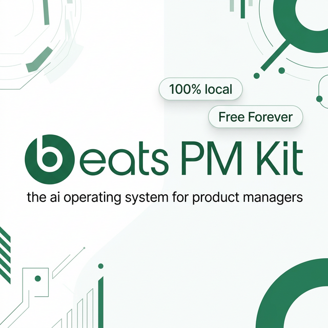

<div align="center">

<!-- HERO BANNER -->


<br/>

# 🧠 Beats PM Antigravity Kit

<h3><em>The AI Operating System That Thinks Like a Product Manager</em></h3>

<p><strong>Paste anything. Get structured tasks. Zero manual tracking. 100% Local Privacy.</strong></p>

<!-- BADGES -->
<p>
  <a href="#"></a>
  &nbsp;
  <a href="https://github.com/officebeats/beats-pm-antigravity-brain/stargazers"></a>
  &nbsp;
  <a href="LICENSE"></a>
</p>

<!-- VALUE PROP PILLS -->
<p>
  
  &nbsp;•&nbsp;
  
  &nbsp;•&nbsp;
  
</p>

<br/>

<!-- CTA BUTTONS -->
<p>
  <a href="#-quick-start"></a>
  &nbsp;
  <a href="#-the-workflow-collection"></a>
</p>

</div>

---

## 🚀 Key Capabilities: The "Boss Protocol"

This kit includes a **Privacy-First Executive Assistant** layer designed for high-stakes leadership management.

*   **`/boss` Workflow**: Prepares you for your 1:1 by synthesizing open action items, identifying stale workstreams, and drafting talking points.
*   **Privacy Hardening**: Automatic PII scrubbing ensures sensitive names and company data never leak to git.
*   **Stale Workstream Detection**: Proactively flags projects that haven't moved in >3 days *before* your boss asks.

---

## ⚡ Quick Start

### 🐣 For Everyone (Simple)

**Step 1: Get the Tools**

Install your preferred AI assistant (Antigravity is primary; CLI tools are secondary):

| Tool                | Install Command                                                                             | Auth Command         |
| ------------------- | ------------------------------------------------------------------------------------------- | -------------------- |
| **Antigravity**     | [Download App](https://antigravity.google/)                                                 | In-app auth          |
| **Gemini CLI**      | `npm install -g @google/gemini-cli`                                                         | `gemini login`       |

**Step 2: Get the Brain**

1. Scroll to the top of this page.
2. Click the green **Code** button → **Download ZIP**.
3. Extract the ZIP file to a folder on your computer (e.g., `Documents/Antigravity`).

**Step 3: Launch**

1. Open your AI tool (terminal or VS Code).
2. Navigate to the extracted folder.
3. Type `/setup` and hit Enter.

### ⚡ For Engineers (Advanced)

```bash
git clone https://github.com/officebeats/beats-pm-antigravity-brain
cd beats-pm-antigravity-brain
# Type /setup in your AI CLI to initialize
```

---

## 🔧 Works With Your Favorite AI Tool

This kit uses a **single source of truth** (`.agent/`) that automatically syncs to all three major AI coding assistants via symlinks.

```
.agent/                    ← SOURCE OF TRUTH (edit here)
    │
    ├── .gemini/           ← Gemini CLI reads this
    ├── .claude/           ← Claude Code reads this
    └── .kilocode/         ← Kilo Code reads this
```

> 💡 **Single Source of Truth**: Edit files in `.agent/` only. Changes sync to all tools automatically.

---

## 💡 Why This Exists

**Product Management is drowning in noise.**

Slack messages piling up. Meeting notes with hidden action items. Emails that say "Can you look into this?" Screenshots of bugs you'll forget about tomorrow.

**This kit solves it—without ever touching the cloud.**

### How It Works

Copy anything to your clipboard. Type `/paste`. Watch the AI:

1. **Detect** what type of content it is (text, image, file)
2. **Extract** every hidden task, bug, and decision—even implicit ones
3. **Route** each item to the correct tracker automatically
4. **Tag** it with the correct company and product context

**No commands to memorize. No manual filing. No lost context.**

### 🔒 100% Local. 100% Private.

| Your Data           | Where It Lives                 | Cloud Access |
| :------------------ | :----------------------------- | :----------- |
| Company strategy    | `1. Company/` on YOUR machine  | ❌ Never     |
| PRDs & specs        | `2. Products/` on YOUR machine | ❌ Never     |
| Meeting transcripts | `3. Meetings/` on YOUR machine | ❌ Never     |
| Stakeholder info    | `4. People/` on YOUR machine   | ❌ Never     |
| Task trackers       | `5. Trackers/` on YOUR machine | ❌ Never     |

**No cloud sync. No telemetry. No API calls with your data.**

The AI processes everything locally. Your company secrets, roadmaps, and stakeholder notes never leave your laptop.

> 🛡️ **Enterprise-Ready**: Folders 1-5 are `.gitignored` by default. Even if you push to GitHub, your private data stays private.

---

## 📖 The Workflow Collection

Type `/` in the chat to see available commands. The AI auto-detects intent, but you can trigger workflows directly.

### 👑 The "Executive Suite" (High-Value Actions)

| Command   | What It Does | Why Use It |
| :-------- | :----------- | :--------- |
| `/boss`   | **1:1 Prep Protocol** | Prepare for your boss meeting. Detects stale tasks & drafts talking points. |
| `/now`    | **Executive Focus** | "What do I do RIGHT NOW?" Filters P0 items and creates a battlefield view. |
| `/week`   | **Weekly Planner** | Anchors your week around the Boss 1:1. Prioritizes "Big Rocks." |
| `/pi`     | **Quarterly Planning** | Orchestrates 3-day PI Planning events. |
| `/plan`   | **Strategy War Room** | Draft Roadmaps, OKRs, and Decision Logs. |

### 🛠️ The "Tactical Engine" (Daily Drivers)

| Command   | What It Does |
| :-------- | :----------- |
| `/paste`  | **Magic Capture**. Paste anything, route to trackers automatically. |
| `/create` | **Doc Factory**. Draft PRDs, Specs, & Memos from context. |
| `/meet`   | **Meeting Syntax**. Process transcripts into Action Items & Decisions. |
| `/stitch` | **UI Generation**. Create visual prototypes alongside PRDs. |
| `/review` | **Quality Control**. Code review, Doc review, Release prep. |
| `/draft`  | **Rapid Drafting**. Create placeholder docs that evolve. |

### ⚡ System Utilities

| Command   | What It Does |
| :-------- | :----------- |
| `/setup`  | Initialize your brain (first-time). |
| `/vibe`   | System health check & diagnostics. |
| `/pulse`  | Context-aware nudges ("You're overloaded"). |
| `/vacuum` | System optimization & archival. |
| `/help`   | Full user manual. |

---

## ⚡ The Architecture

This kit uses the **Antigravity Modular Architecture**—the same pattern used in Google's internal AI tools.

### Three Layers

```
┌─────────────────────────────────────────────┐
│  📋 WORKFLOWS (24)                          │
│  Playbooks triggered by /commands           │
│  → /boss, /now, /create, /meet...           │
├─────────────────────────────────────────────┤
│  🧠 SKILLS (26)                             │
│  Modular AI expertise, loaded on-demand     │
│  → boss-tracker, risk-guardian, stitch...   │
├─────────────────────────────────────────────┤
│  🤖 AGENTS (7)                              │
│  Virtual team personas with behaviors       │
│  → Staff PM, CPO, Strategist, Tech Lead...  │
└─────────────────────────────────────────────┘
```

### 🧠 26 Skills (AI Expertise)

| Skill Category | Skills included |
| :------------- | :-------------- |
| **Execution** | `inbox-processor`, `task-manager`, `meeting-synth`, `daily-synth`, `weekly-synth` |
| **Leadership** | `boss-tracker`, `stakeholder-mgr`, `chief-strategy-officer`, `okr-manager` |
| **Product** | `prd-author`, `product-marketer`, `requirements-translator`, `ux-researcher` |
| **Engineering** | `engineering-collab`, `code-simplifier`, `bug-chaser`, `frontend-engineer` |
| **System** | `core-utility`, `vacuum-protocol`, `risk-guardian`, `visual-processor`, `stitch` |

---

## 📁 Directory Structure

```
beats-pm-antigravity-brain/
├── 0. Incoming/           # Drop Zone (Screenshots, Notes)
├── 1. Company/            # Strategy & Profiles (LOCAL ONLY)
├── 2. Products/           # PRDs & Specs (LOCAL ONLY)
├── 3. Meetings/           # Transcripts (LOCAL ONLY)
├── 4. People/             # Stakeholders (LOCAL ONLY)
├── 5. Trackers/           # Task Ledgers (LOCAL ONLY)
│
├── .agent/                # ⭐ SOURCE OF TRUTH
│   ├── agents/            # Virtual Team Personas
│   ├── rules/GEMINI.md    # Core Rules File
│   ├── skills/            # 26 Modular Skills
│   ├── templates/         # FAANG Document Templates
│   └── workflows/         # 24 Playbooks
│
├── .gemini/               # Gemini CLI (symlinks to .agent/)
├── .claude/               # Claude Code (symlinks to .agent/)
├── .kilocode/             # Kilo Code (symlinks to .agent/)
│
├── system/                # Python Scripts & Utils
├── SETTINGS.md            # Your Configuration
└── STATUS.md              # Current Dashboard
```

---

## 🤝 Contributing

Open source and community driven. Pull Requests welcome.

---

## 👨‍💻 About the Creator

<div align="center">

**Ernesto "Beats"**

_ex-BCG Digital Product Lead · ex-Fetch Rewards Senior Product Lead_

Building the future of AI-powered product management.

<br/>

[](https://www.linkedin.com/in/productmg/)
&nbsp;
[](https://x.com/officebeats)
&nbsp;
[](https://github.com/officebeats)

</div>

---

<div align="center">

**Built by PMs, for PMs.**

_Stop chasing status updates. Start driving strategy._

<br/>

⭐ **Star this repo** if it saves you time.

</div>
