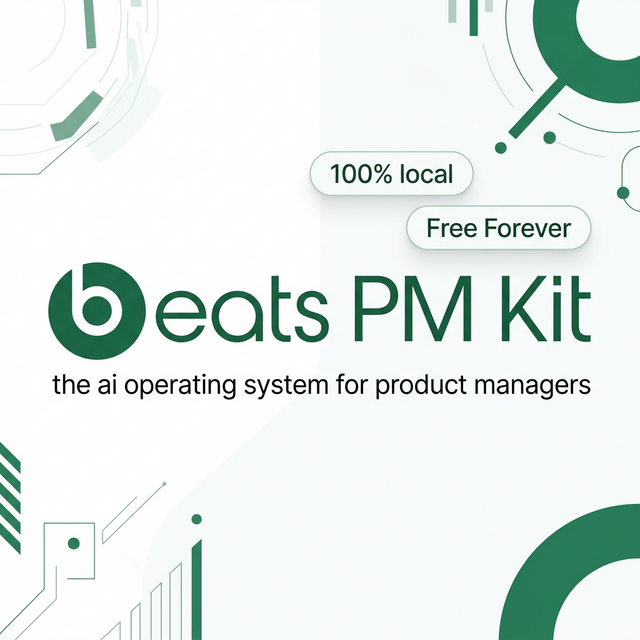

<div align="center">

<!-- HERO BANNER -->



<br/>

# 🧠 Beats PM Antigravity Kit

<h3><em>The AI Operating System That Thinks Like a Product Manager</em></h3>

<p><strong>Paste anything. Get structured tasks. Zero manual tracking. 100% Local Privacy.</strong></p>

<!-- BADGES -->

<p>
  <a href="#"></a>
   
  <a href="https://github.com/officebeats/beats-pm-antigravity-brain/stargazers"></a>
   
  <a href="LICENSE"></a>
</p>

<!-- VALUE PROP PILLS -->

<p>
  
   • 
  
   • 
  
</p>

<br/>

<!-- CTA BUTTONS -->

<p>
  <a href="#-quick-start"></a>
   
  <a href="#-the-workflow-collection"></a>
</p>

</div>

---

## 🚀 Key Capabilities: The "Boss Protocol"

This kit includes a **Privacy-First Executive Assistant** layer designed for high-stakes leadership management.

- **`/boss` Workflow**: Prepares you for your 1:1 by synthesizing open action items, identifying stale workstreams, and drafting talking points.
- **Privacy Hardening**: Automatic PII scrubbing ensures sensitive names and company data never leak to git.
- **Stale Workstream Detection**: Proactively flags projects that haven't moved in >3 days _before_ your boss asks.

---

## ⚡ Quick Start

### 🐣 For Everyone (Simple)

**Step 1: Get the Tools**

Install your preferred AI assistant (Antigravity is primary; CLI tools are secondary):

| Tool            | Install Command                             | Auth Command   |
| --------------- | ------------------------------------------- | -------------- |
| **Antigravity** | [Download App](https://antigravity.google/) | In-app auth    |
| **Gemini CLI**  | `npm install -g @google/gemini-cli`         | `gemini login` |

**Step 2: Get the Brain**

1. Scroll to the top of this page.
2. Click the green **Code** button → **Download ZIP**.
3. Extract the ZIP file to a folder on your computer (e.g., `Documents/Antigravity`).

**Step 3: Launch**

1. Open your AI tool (terminal or VS Code).
2. Navigate to the extracted folder.
3. **Antigravity**: Type `/` to see the interactive menu, or `/setup` directly
4. **CLI tools**: Type `/setup` (or `#setup` for Gemini CLI)

### ⚡ For Engineers (Advanced)

```bash
git clone https://github.com/officebeats/beats-pm-antigravity-brain
cd beats-pm-antigravity-brain
# Type /setup in your AI CLI to initialize
```

---

## 🔧 Works With Your Favorite AI Tool

This kit uses a **single source of truth** (`.agent/`) that automatically syncs to all major AI tools via symlinks.

```
.agent/                    ← SOURCE OF TRUTH (edit here)
    │
    ├── .gemini/           ← Gemini CLI reads this
    ├── .claude/           ← Claude Code reads this
    └── .kilocode/         ← Kilo Code reads this
```

> 💡 **Single Source of Truth**: Edit files in `.agent/` only. Changes sync to all tools automatically.

### Command Support by Tool

| Tool            | Interactive Menu               | Commands                      | Notes                               |
| --------------- | ------------------------------ | ----------------------------- | ----------------------------------- |
| **Antigravity** | ✅ Type `/` to see all options | 22 workflows                  | Full menu support - primary runtime |
| **Claude Code** | ❌ Manual typing only          | Type `/vacuum`, `/boss`, etc. | Commands must be typed manually     |
| **Kilo Code**   | ❌ Manual typing only          | Type `/vacuum`, `/boss`, etc. | Commands must be typed manually     |
| **Gemini CLI**  | ❌ Manual typing only          | Type `#vacuum`, `#boss`, etc. | Commands must be typed manually     |

> ⚠️ **Antigravity is the primary runtime** - it offers the interactive workflow menu. CLI tools require manual command entry.

---

## 💡 Why This Exists

**Product Management is drowning in noise.**

Slack messages piling up. Meeting notes with hidden action items. Emails that say "Can you look into this?" Screenshots of bugs you'll forget about tomorrow.

**This kit solves it—without ever touching the cloud.**

### How It Works

Copy anything to your clipboard. Type `/paste`. Watch the AI:

1. **Detect** what type of content it is (text, image, file)
2. **Extract** every hidden task, bug, and decision—even implicit ones
3. **Route** each item to the correct tracker automatically
4. **Tag** it with the correct company and product context

**No commands to memorize. No manual filing. No lost context.**

### 🔒 100% Local. 100% Private.

| Your Data           | Where It Lives                 | Cloud Access |
| :------------------ | :----------------------------- | :----------- |
| Company strategy    | `1. Company/` on YOUR machine  | ❌ Never     |
| PRDs & specs        | `2. Products/` on YOUR machine | ❌ Never     |
| Meeting transcripts | `3. Meetings/` on YOUR machine | ❌ Never     |
| Stakeholder info    | `4. People/` on YOUR machine   | ❌ Never     |
| Task trackers       | `5. Trackers/` on YOUR machine | ❌ Never     |

**No cloud sync. No telemetry. No API calls with your data.**

The AI processes everything locally. Your company secrets, roadmaps, and stakeholder notes never leave your laptop.

> 🛡️ **Enterprise-Ready**: Folders 1-5 are `.gitignored` by default. Even if you push to GitHub, your private data stays private.

---

## 📇 What's Inside: The Kit Reference

This isn't just a list of prompts. It's a complete Operating System anchored on **38 Skills**, **11 Agents**, and **31 Playbooks**.

### 🤖 The Virtual Team (Agents)

| Agent                     | Best For                  | Frameworks / Basis         | Amazon Reference                                                                                                  |
| :------------------------ | :------------------------ | :------------------------- | :---------------------------------------------------------------------------------------------------------------- |
| **Staff PM**              | Execution, PRDs, meetings | BaseCamp Shape Up          | [Shape Up](https://www.amazon.com/s?k=Shape+Up+Ryan+Singer)                                                       |
| **Chief Product Officer** | Strategy, org design      | Good Strategy/Bad Strategy | [Good Strategy Bad Strategy](https://www.amazon.com/s?k=Good+Strategy+Bad+Strategy)                               |
| **Product Strategist**    | Market analysis, vision   | 7 Powers                   | [7 Powers](https://www.amazon.com/s?k=7+Powers+Hamilton+Helmer)                                                   |
| **Program Manager**       | Dependencies, releases    | SAFe / Project Management  | [Project Management...](https://www.amazon.com/s?k=Project+Management+for+the+Unofficial+Project+Manager)         |
| **Tech Lead**             | Feasibility, tech debt    | Clean Code                 | [Clean Code](https://www.amazon.com/s?k=Clean+Code+Robert+Martin)                                                 |
| **Data Scientist**        | Metrics, experiments      | Reforge / Google HEART     | [Trustworthy Online Controlled Experiments](https://www.amazon.com/s?k=Trustworthy+Online+Controlled+Experiments) |
| **UX Researcher**         | Interviews, personas      | Continuous Discovery       | [Continuous Discovery Habits](https://www.amazon.com/s?k=Continuous+Discovery+Habits)                             |
| **GTM Lead**              | Launch planning           | Obviously Awesome          | [Obviously Awesome](https://www.amazon.com/s?k=Obviously+Awesome+April+Dunford)                                   |

### ⚡ The Playbooks (Workflows)

| Command           | Best For               | Frameworks / Basis         | Amazon Reference                                                                                  |
| :---------------- | :--------------------- | :------------------------- | :------------------------------------------------------------------------------------------------ |
| **`/boss`**       | 1:1 Prep & Managing Up | Radical Candor             | [Radical Candor](https://www.amazon.com/s?k=Radical+Candor)                                       |
| **`/now`**        | Executive Focus Filter | Essentialism               | [Essentialism](https://www.amazon.com/s?k=Essentialism+Greg+McKeown)                              |
| **`/plan`**       | Strategic Planning     | OKRs                       | [Measure What Matters](https://www.amazon.com/s?k=Measure+What+Matters)                           |
| **`/ship`**       | Release Management     | DevOps                     | [The DevOps Handbook](https://www.amazon.com/s?k=The+DevOps+Handbook)                             |
| **`/retro`**      | Team Retrospectives    | Agile Retrospectives       | [Agile Retrospectives](https://www.amazon.com/s?k=Agile+Retrospectives)                           |
| **`/compete`**    | Competitive Analysis   | Porter's 5 Forces          | [Competitive Strategy](https://www.amazon.com/s?k=Competitive+Strategy+Michael+Porter)            |
| **`/discover`**   | Product Discovery      | Opportunity Solution Trees | [Continuous Discovery Habits](https://www.amazon.com/s?k=Continuous+Discovery+Habits)             |
| **`/prioritize`** | Backlog Ranking        | Cost of Delay / WSJF       | [Product Development Flow](https://www.amazon.com/s?k=The+Principles+of+Product+Development+Flow) |
| **`/meet`**       | Meeting Synthesis      | Effective Meetings         | [The Effective Executive](https://www.amazon.com/s?k=The+Effective+Executive)                     |
| **`/create`**     | Document Drafting      | Working Backwards          | [Working Backwards](https://www.amazon.com/s?k=Working+Backwards+Colin+Bryar)                     |

### 🧠 Domain Skills (AI Expertise)

| Skill                     | Best For                 | Frameworks / Basis    | Amazon Reference                                                                           |
| :------------------------ | :----------------------- | :-------------------- | :----------------------------------------------------------------------------------------- |
| **ux-researcher**         | Synthesis, interviews    | The Mom Test          | [The Mom Test](https://www.amazon.com/s?k=The+Mom+Test)                                    |
| **data-analytics**        | Funnels, metrics         | Lean Analytics        | [Lean Analytics](https://www.amazon.com/s?k=Lean+Analytics)                                |
| **product-marketer**      | Positioning, battlecards | Crossing the Chasm    | [Crossing the Chasm](https://www.amazon.com/s?k=Crossing+the+Chasm)                        |
| **discovery-coach**       | Assumption testing       | Inspired / Empowered  | [Inspired](https://www.amazon.com/s?k=Inspired+Marty+Cagan)                                |
| **dependency-tracker**    | Critical path mapping    | Theory of Constraints | [The Goal](https://www.amazon.com/s?k=The+Goal+Goldratt)                                   |
| **communication-crafter** | High-stakes emails       | Pyramid Principle     | [The Minto Pyramid Principle](https://www.amazon.com/s?k=The+Minto+Pyramid+Principle)      |
| **boss-tracker**          | Managing "Boss Asks"     | Managing Up (HBR)     | [HBR Guide to Managing Up](https://www.amazon.com/s?k=HBR+Guide+to+Managing+Up+and+Across) |

### 📄 Strategic Templates

| Template            | Best For         | Frameworks / Basis  | Amazon Reference                                                                                |
| :------------------ | :--------------- | :------------------ | :---------------------------------------------------------------------------------------------- |
| **roadmap-visual**  | Timeline & scope | Roadmap Strategy    | [Roadmaps Relaunched](https://www.amazon.com/s?k=Roadmaps+Relaunched)                           |
| **qbr-scorecard**   | Exec reporting   | Rockefeller Habits  | [Mastering the Rockefeller Habits](https://www.amazon.com/s?k=Mastering+the+Rockefeller+Habits) |
| **discovery-brief** | Problem framing  | Design Sprints      | [Sprint](https://www.amazon.com/s?k=Sprint+Jake+Knapp)                                          |
| **prioritization**  | Scoring math     | The 80/20 Principle | [The 80/20 Principle](https://www.amazon.com/s?k=The+80/20+Principle)                           |
| **release-plan**    | Launch gates     | Continuous Delivery | [Continuous Delivery](https://www.amazon.com/s?k=Continuous+Delivery+Jez+Humble)                |
| **strategy-memo**   | Major pivots     | Working Backwards   | [Working Backwards](https://www.amazon.com/s?k=Working+Backwards)                               |

---

## 📁 Directory Structure

```
beats-pm-antigravity-brain/
├── 0. Incoming/           # Drop Zone (LOCAL ONLY, Screenshots, Notes)
├── 1. Company/            # Strategy & Profiles (LOCAL ONLY)
├── 2. Products/           # PRDs & Specs (LOCAL ONLY)
├── 3. Meetings/           # Transcripts (LOCAL ONLY)
├── 4. People/             # Stakeholders (LOCAL ONLY)
├── 5. Trackers/           # Task Ledgers (LOCAL ONLY)
│
├── .agent/                # ⭐ SOURCE OF TRUTH
│   ├── agents/            # Virtual Team Personas
│   ├── rules/GEMINI.md    # Core Rules File
│   ├── skills/            # 26 Modular Skills
│   ├── templates/         # FAANG Document Templates
│   └── workflows/         # 24 Playbooks
│
├── .gemini/               # Gemini CLI (symlinks to .agent/)
├── .claude/               # Claude Code (symlinks to .agent/)
├── .kilocode/             # Kilo Code (symlinks to .agent/)
│
├── system/                # Python Scripts & Utils
├── SETTINGS.md            # Your Configuration
└── STATUS.md              # Current Dashboard
```

---

## 🤝 Contributing

Open source and community driven. Pull Requests welcome.

---

## 👨‍💻 About the Creator

<div align="center">

**Ernesto "Beats"**

_ex-BCG Digital Product Lead · ex-Fetch Rewards Senior Product Lead_

Building the future of AI-powered product management.

<br/>

[](https://www.linkedin.com/in/productmg/)
&nbsp;
[](https://x.com/officebeats)
&nbsp;
[](https://github.com/officebeats)

</div>

---

## 🛠️ Recommended: Antigravity Cockpit Extension

For an even more intuitive experience, check out the **[Antigravity Cockpit](https://github.com/jlcodes99/vscode-antigravity-cockpit)** VS Code extension.

One of our favorite features is how it displays your **remaining usage quota** directly in the VS Code footer. It's an incredibly intuitive way—especially for free users—to see exactly how much usage is left at a glance.

- **Status Bar Monitoring**: See your quota percentages and countdowns without leaving your code.
- **Multi-Model Pinning**: Monitor multiple AI models simultaneously.
- **Auto-Focus**: Automatically shows the model with the lowest remaining quota.

[View Extension on GitHub](https://github.com/jlcodes99/vscode-antigravity-cockpit)

---

## 🛠️ Recommended: Better Antigravity Extension

Enhance your Antigravity experience with the **[Better Antigravity](https://open-vsx.org/vscode/item?itemName=kanezal.better-antigravity)** extension.

- **Improved Grammar & Syntax**: Advanced logic for better PM-style writing.
- **Enhanced Logic Processing**: Smoother task extraction and routing.
- **Performance Optimized**: Built for speed and 100% local operation.

[View Extension on Open VSX](https://open-vsx.org/vscode/item?itemName=kanezal.better-antigravity)

---

<div align="center">

**Built by PMs, for PMs.**

_Stop chasing status updates. Start driving strategy._

<br/>

⭐ **Star this repo** if it saves you time.

</div>
